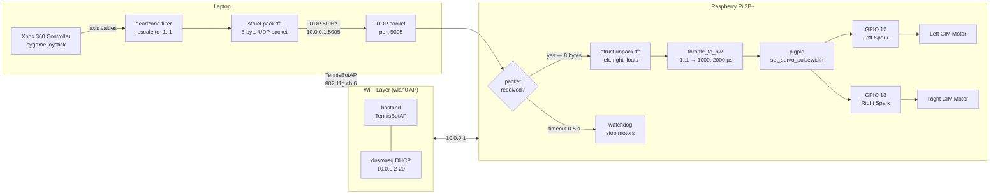

# Code Walkthrough

## System Diagram



---

## Packet Format

The entire control protocol is a single 8-byte UDP datagram:

```
 0       4       8
 ┌───────┬───────┐
 │ left  │ right │   (two 32-bit IEEE 754 floats, little-endian)
 └───────┴───────┘
  -1.0 .. 1.0    -1.0 .. 1.0
```

`struct.pack("ff", left, right)` on the laptop → `struct.unpack("ff", data)` on the Pi.

---

## Controller Side (`controller/controller.py`)

```
main()
 ├─ find_controller()          # scans pygame joysticks, prefers Xbox/360 name
 ├─ loop @ 50 Hz
 │   ├─ pygame.event.pump()   # flush OS events (required even if unused)
 │   ├─ check Back button → e-stop (0.0, 0.0)
 │   ├─ read AXIS_LEFT_Y, AXIS_RIGHT_Y
 │   ├─ negate (pygame Y-up = -1, we want +1 = forward)
 │   ├─ deadzone(value)       # zero small deflections, rescale remainder
 │   └─ sock.sendto(struct.pack("ff", left, right), dest)
 └─ on KeyboardInterrupt: send (0.0, 0.0) then quit
```

**Deadzone rescaling** — instead of just zeroing values under the threshold, the function rescales so output starts at 0 right at the edge, avoiding a jump:
```python
sign * (abs(value) - threshold) / (1.0 - threshold)
```

---

## Robot Side (`robot/robot.py`)

```
Robot.__init__()
 ├─ pigpio.pi()               # connect to pigpiod daemon over local socket
 ├─ stop()                    # set both pins to 1500 µs (neutral) immediately
 ├─ UDP socket bind("", 5005)
 └─ sock.settimeout(0.5)      # drives the watchdog

Robot.run()  [blocking loop]
 ├─ recvfrom(8) — blocks up to 0.5 s
 │   ├─ on data: unpack → set_motors()
 │   └─ on timeout: stop()   # watchdog fires
 └─ SIGINT/SIGTERM → _shutdown() → stop() → pi.stop()

throttle_to_pw(t)
 └─ 1500 + clamp(t, -1, 1) * 500
    # -1.0 → 1000 µs (full reverse)
    #  0.0 → 1500 µs (neutral)
    # +1.0 → 2000 µs (full forward)
```

The `LEFT_INVERT` / `RIGHT_INVERT` flags negate the float *before* the pulsewidth conversion, so the motor direction is flipped in software without rewiring.

---

## Safety Chain

Three independent layers prevent uncontrolled motion:

1. **Deadzone** (controller) — mechanical stick noise near center is zeroed before any packet is sent.
2. **Emergency stop** (controller) — Back button overrides axis values to `(0.0, 0.0)` in software.
3. **Watchdog** (robot) — `sock.settimeout(0.5)` means `recvfrom` raises `socket.timeout` if no packet arrives; the exception handler calls `stop()` unconditionally.

The watchdog means the robot brakes on its own if the laptop crashes, WiFi drops, or `Ctrl-C` is hit mid-packet.
